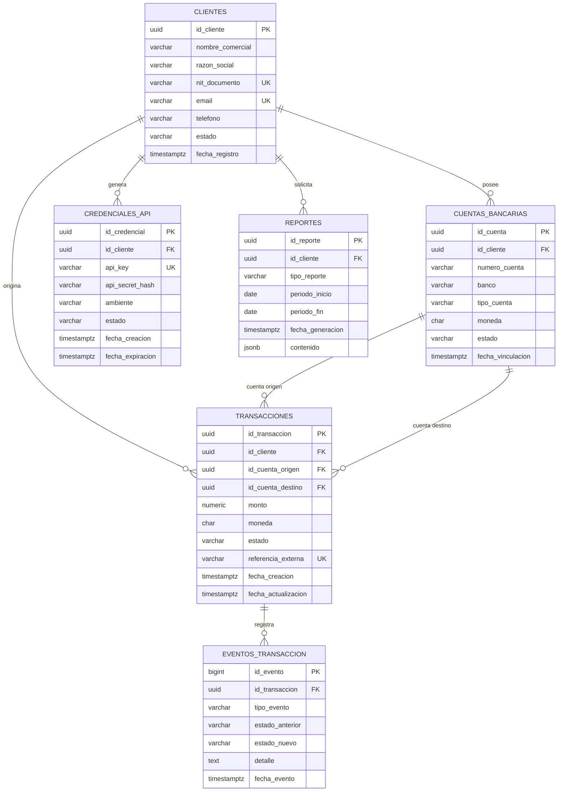
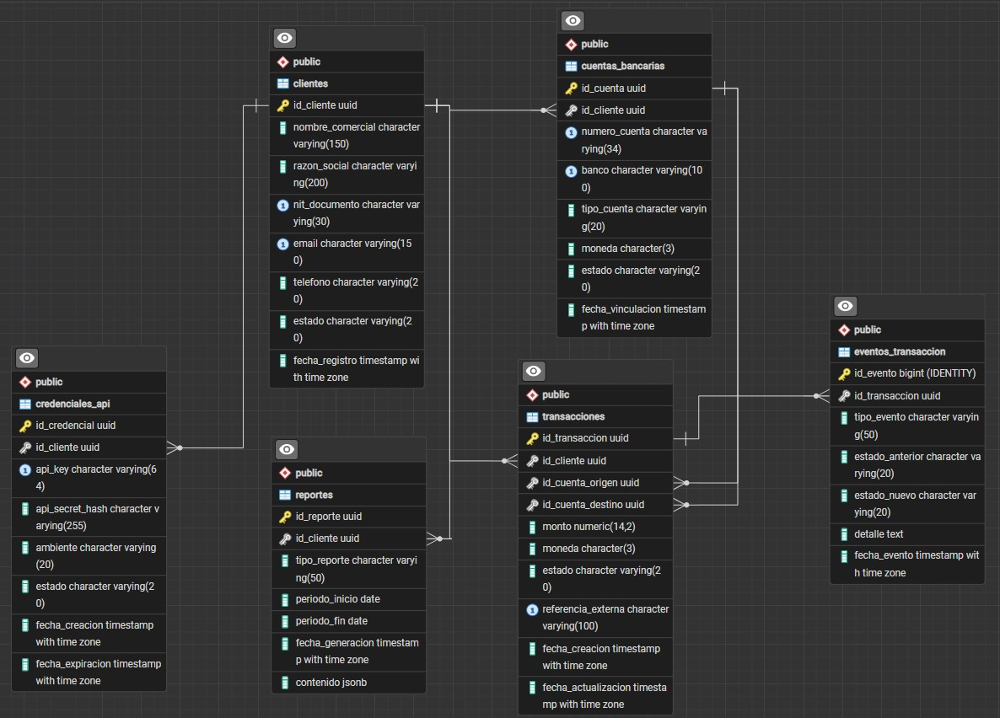
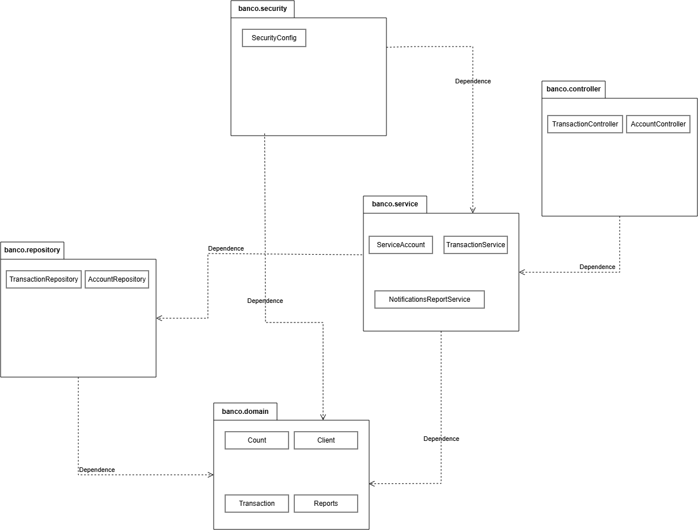
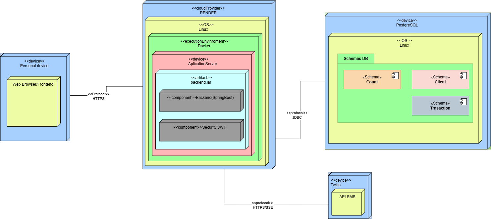
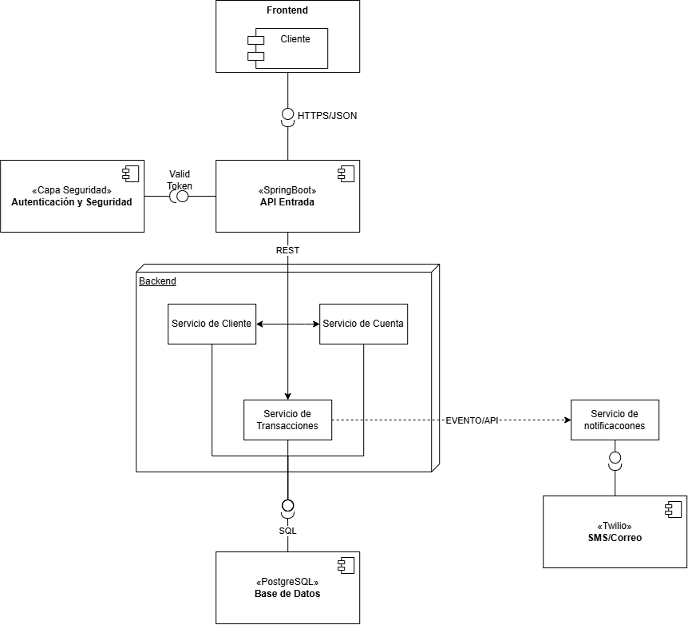

# EAV08-2026-2

### Diagrama Entidad Relación 

# Modelo lógico

---
# Diagrama de paquetes

# Diagrama de despliegue

# Diagrama de componentes

# Criterio 4- Modelo Fisico

Ver [`schema.sql`](./schema.sql)

